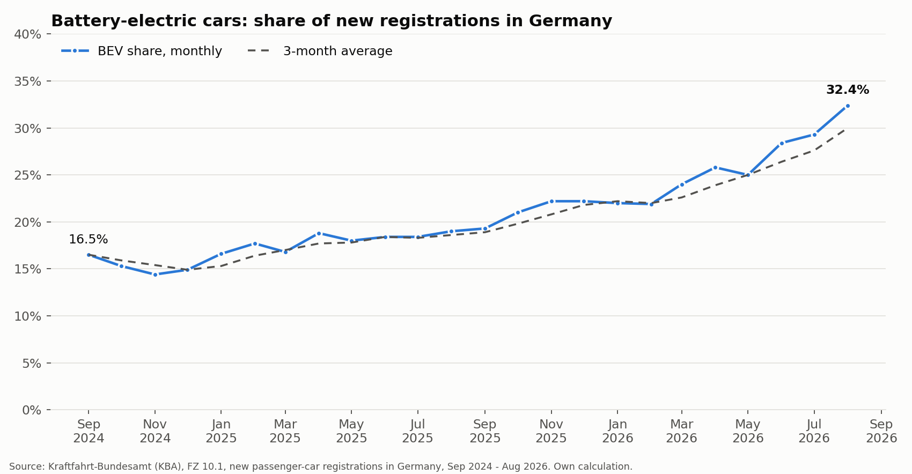
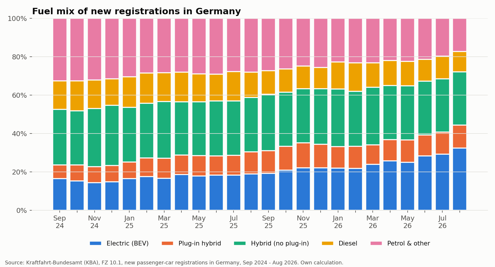
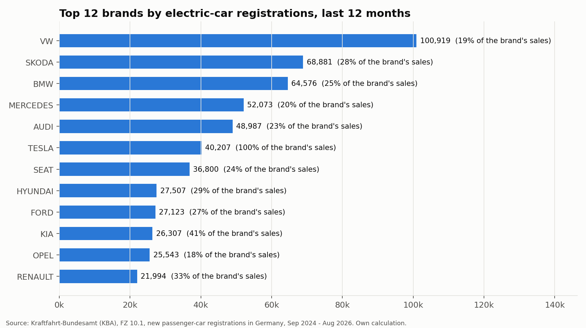
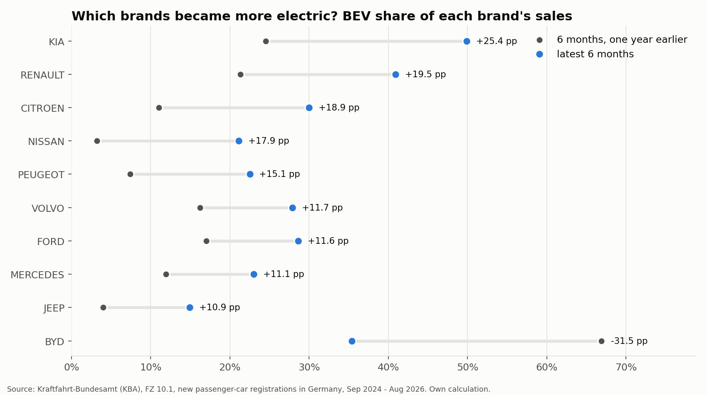
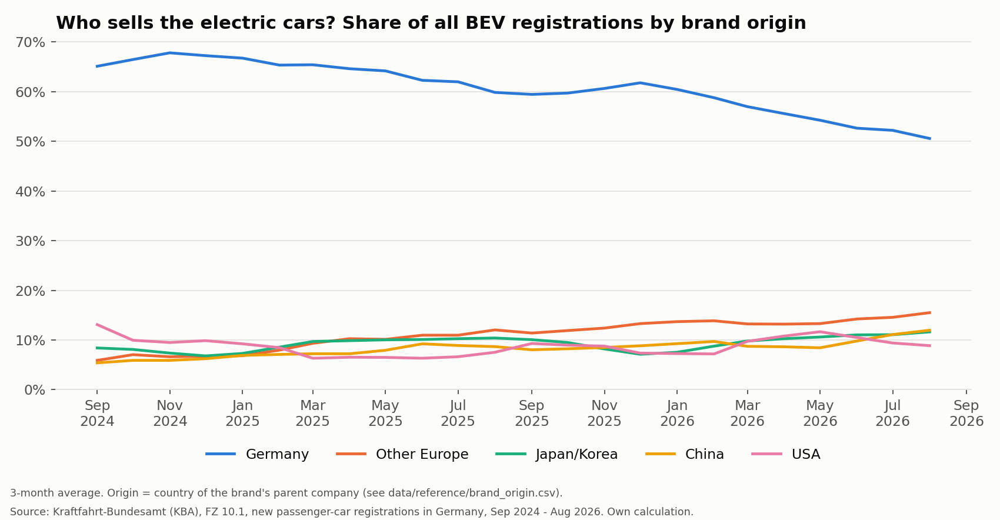

# German EV & Automotive Market Analysis

**Question:** How is the German new-car market shifting toward electric vehicles, and which brands and brand groups are driving it?

SQL, Python and Power BI analysis of 24 months of official new-car registration data (Sep 2024 to Aug 2026) from the German Federal Motor Transport Authority (KBA).



## Key findings

*(Every number below is computed by `src/run_analysis.py` and also written to [`reports/findings.md`](reports/findings.md).)*

- **Electric share almost doubled year on year.** Battery-electric cars (BEV) made up **32.4%** of new registrations in Aug 2026, up from **19.0%** in Aug 2025 (+13.4 percentage points).
- **Growth is real, not seasonal.** Jan to Aug 2026: BEV share **26.2%** vs **18.0%** in the same months of 2025. BEV units grew **+53%** while total registrations grew only **+4.8%**.
- **Combustion-only cars are shrinking.** Diesel plus petrol without any electrification fell from **43.4%** to **34.0%** of registrations (same eight months).
- **Volume comes from the big group brands.** Last 12 months: VW 100,919 BEVs (14.0% of all BEVs), Skoda 68,881 (9.6%), BMW 64,576 (9.0%).
- **The market is broadening.** Chinese-parent brands (BYD, MG, Volvo/Polestar via Geely, and others) delivered **12.0%** of BEVs in Aug 2026 vs **7.9%** a year earlier. German-parent brands fell from **58.6%** to **47.5%** of BEVs.
- **Biggest movers.** Kia's BEV share went from 24.5% to 49.9% (latest 6 months vs the same 6 months a year earlier). BYD moved the other way (-31.5 pp): its plug-in hybrid share rose from 33.1% to 64.6% while its volume roughly quadrupled, which shows why BEV share alone does not tell the whole story.



<p>


</p>



## Data

| | |
|---|---|
| Source | Kraftfahrt-Bundesamt (KBA), table FZ 10.1, monthly Excel files |
| Period | Sep 2024 to Aug 2026 (24 months) |
| Size | 51,975 rows (month x brand x model x fuel), 5.73 million registrations |
| Details | [`data/README.md`](data/README.md) |

## Method

1. **Parse** the human-formatted KBA sheets into one tidy table ([`src/kba_fz10.py`](src/kba_fz10.py)).
2. **Validate** every month against KBA's own printed grand total (`NEUZULASSUNGEN INSGESAMT`). All 24 months match exactly. The build stops if one does not.
3. **Load** into SQLite ([`sql/schema.sql`](sql/schema.sql)) and analyse with SQL ([`sql/analysis_queries.sql`](sql/analysis_queries.sql)): CTEs, window functions (`LAG`, `RANK`, moving average), conditional aggregation, joins.
4. **Chart** with matplotlib and **export** clean tables for Power BI ([`dashboard/POWERBI_GUIDE.md`](dashboard/POWERBI_GUIDE.md)).

### Things in the raw files that would silently produce wrong numbers

| Problem | Handling |
|---|---|
| Subtotal rows (`AUDI ZUSAMMEN`) | Removed, and used to check that model rows add up |
| Brand only written on the first row of its block | Forward fill |
| Fuel groups overlap (hybrid incl. plug-in contains plug-in hybrid) | Only non-overlapping groups used; verified on Audi: 6,521 = 3,182 + 3,339 |
| Each group has month, year-to-date and share columns | Only the month column is used, to avoid double counting |
| Zero written as `-`, some counts stored as text | Converted |
| Two different header layouts across months | Header search handles both |
| "Other brands" (`SONSTIGE`) has no model rows in some months | Kept; dropping it made the total 1,082 cars short in Aug 2026 |
| SsangYong renamed KGM in April 2025 | Merged into one brand |

The "other brands" issue was found by the grand-total check, not by inspection. That is why the check is part of the build.

### Fuel categories
BEV, plug-in hybrid, hybrid without plug-in, diesel, and petrol & other. The file has no petrol column, so **petrol & other = total minus the other four** (it also contains small volumes of gas, hydrogen and other drives).

## Limitations

- Registrations are not sales. Fleet, dealer and self-registrations are included, and KBA can revise a month later.
- "Hybrid (no plug-in)" includes 48V mild hybrids because KBA counts them as hybrids.
- "Origin" groups brands by the parent company's country (for example Volvo counts as China because of Geely, Opel as Other Europe because of Stellantis). This involves judgement; edit [`data/reference/brand_origin.csv`](data/reference/brand_origin.csv) and re-run to test other groupings.
- 24 months show the trend, but are too short to draw conclusions about long-term seasonality.
- Model-level names follow KBA groupings (for example `ID.4, ID.5` is one row).

## Reproduce it

```bash
git clone https://github.com/aishwarya-sonawane/german-ev-market-analysis
cd german-ev-market-analysis
pip install -r requirements.txt

# 1. put the KBA Excel files into data/raw/  (see data/README.md)
python src/build_dataset.py     # clean + validate + build SQLite
python src/run_analysis.py      # SQL queries, charts, findings, Power BI tables
pytest -q                       # 11 parser tests
```

Or open the notebooks: [`01_load_and_clean`](notebooks/01_load_and_clean.ipynb) explains the cleaning, [`02_analysis`](notebooks/02_analysis.ipynb) walks through the analysis.

## Repository structure

```
src/           kba_fz10.py (parser), build_dataset.py, run_analysis.py
sql/           schema.sql, analysis_queries.sql
notebooks/     01_load_and_clean, 02_analysis
tests/         parser tests on synthetic files that copy the KBA layout
data/          README, reference/brand_origin.csv, processed/ (tidy CSV, parse report)
dashboard/     Power BI tables and build guide
images/        charts used above
reports/       findings.md and the result of every SQL query
```

## Tools
Python (pandas, openpyxl, matplotlib), SQL (SQLite), Power BI, pytest.

*Source: Kraftfahrt-Bundesamt (KBA), Flensburg. Own calculations.*
